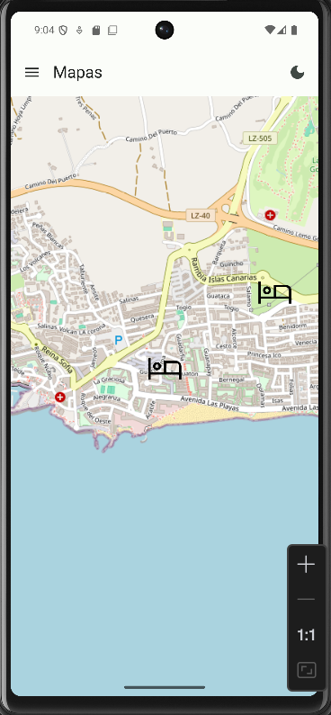

# RoomMapApp

Aplicación Android desarrollada como parte del proyecto de Programación Multimedia y Dispositivos Móviles en IES Haría. Esta aplicación permite visualizar y gestionar marcadores en un mapa interactivo de Lanzarote, utilizando la biblioteca OSMDroid.

## Características

- Visualización de mapa interactivo de Lanzarote
- Gestión de marcadores por categorías (Restaurantes, Hoteles, Monumentos, Parques)
- Soporte para tema claro/oscuro
- Almacenamiento local de datos usando Room
- Interfaz de usuario moderna con Material Design 3
- Navegación intuitiva con menú lateral

## Capturas de Pantalla

### Pantalla Principal


*Descripción: Vista principal de la aplicación mostrando el mapa con marcadores.*

### Menú de Marcadores


*Descripción: Menú lateral mostrando los diferentes tipos de marcadores disponibles.*

## Tecnologías Utilizadas

- **Lenguaje:** Kotlin
- **Arquitectura:** MVVM (Model-View-ViewModel)
- **Bibliotecas principales:**
  - OSMDroid para mapas
  - Room para persistencia de datos
  - Hilt para inyección de dependencias
  - Jetpack Compose para la interfaz de usuario
  - Material 3 para el diseño
  - Corrutinas y Flow para operaciones asíncronas

## Estructura del Proyecto

```
app/
├─ data/           # Capa de datos
│  ├─ database/    # Entidades y DAOs de Room
│  ├─ mapper/      # Transformación entre entidades de base de datos y modelos de dominio
│  ├─ repository/  # Implementaciones de repositorios
├─ di/             # Módulos de Hilt
├─ domain/         # Lógica de negocio
│  ├─ model/       # Modelos de dominio
│  ├─ repository/  # Interfaces de repositorio
│  ├─ usecase/     # Casos de uso
│  ├─ util/        # Utilidades generales como gestión de errores, constantes y resultados
├─ presentation/   # Capa de presentación
│  ├─ model/       # Modelos de estado y eventos para la capa de presentación
│  ├─ ui/          # Componentes de UI
│  ├─ viewmodel/   # ViewModels
```

## Autor

Jose Antonio Navarro Perez
